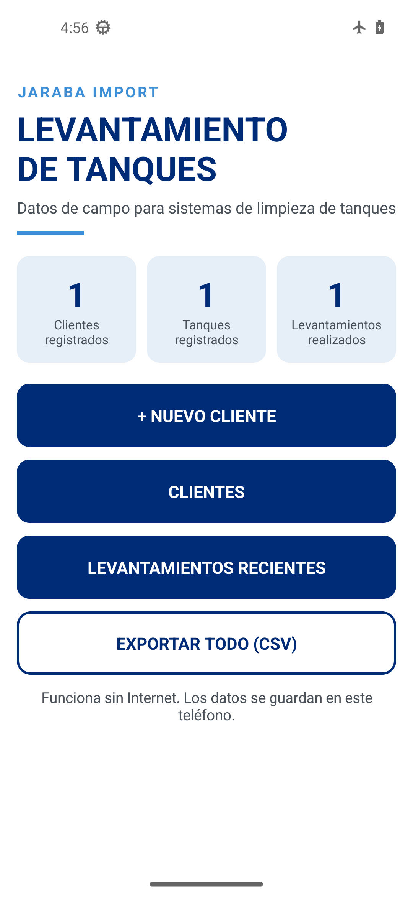
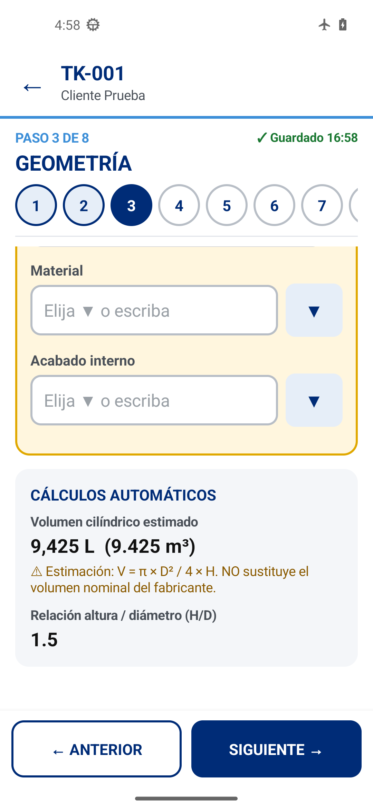
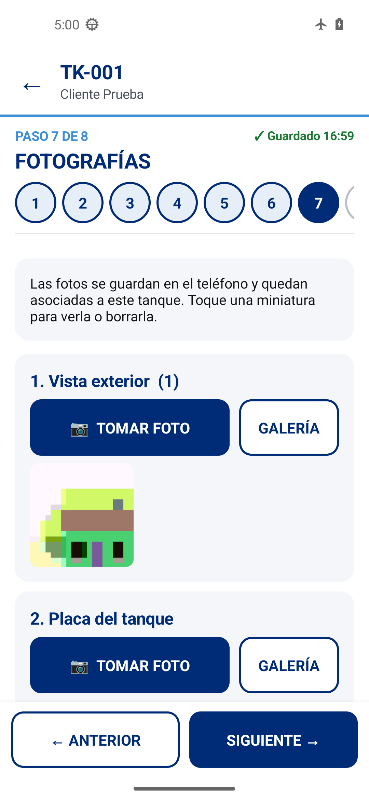
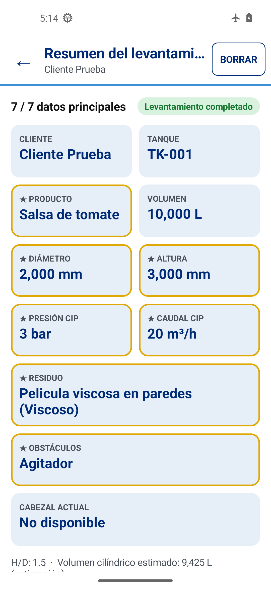

# Levantamiento de Tanques – V1

> **Estado:** compilada con Gradle en GitHub Actions y verificada en emulador Android 13 sin red (ver §10).
> Corregido el cierre al abrir en Android 11+ (ver §10.1).

App Android **100 % offline** para registrar en campo el levantamiento técnico de tanques de producción
(clientes → tanques → levantamiento), como base para la posterior selección de cabezales de limpieza.

- Kotlin + vistas nativas de Android + SQLite nativo. **Sin librerías externas.**
- Sin servidor, sin Firebase y **sin permiso de Internet**: el sistema operativo no le deja a la app conectarse a la red.
- Datos, fotos y firmas se guardan en el almacenamiento interno del teléfono.

---

## 1. Entregables

Todo se genera en **GitHub Actions** (pestaña *Actions* del repositorio → última ejecución de *Android CI*):

| Artefacto | Contenido |
|---|---|
| `apks` | `app-release.apk` (**la que se instala en los teléfonos**, firmada con la clave del proyecto) y `app-debug.apk`. |
| `evidence` | Capturas de pantalla del recorrido de aceptación, `resultados.md`, PDF y CSV generados por la app, `logcat.txt`. |

> Si los secretos de firma no están configurados (§4), la release sale como `app-release-unsigned.apk`, que **no se puede instalar**.

---

## 2. Instalar la APK en el teléfono

1. Descargue el artefacto `apks` (es un .zip) y extraiga `app-release.apk`.
2. Copie la APK al teléfono (WhatsApp, correo, cable USB o Google Drive) y ábrala.
3. Si Android lo pide, permita **"Instalar apps de origen desconocido"** para esa app (Archivos, Chrome, WhatsApp…).
4. Pulse **Instalar**. Requiere **Android 8.0 o superior**.
5. Para actualizar a una versión nueva, instale la nueva APK encima: se conservan los datos (siempre que se firme con la misma clave).

> Si en el teléfono había una versión anterior firmada con otra clave (p. ej. una APK de depuración), desinstálela primero.
> Play Protect puede mostrar un aviso por ser una app que no viene de Google Play; es normal en apps internas. Elija "Instalar de todas formas".

Con cable USB y `adb`: `adb install -r app-release.apk`

---

## 3. Compilar

Automático: cada `git push` ejecuta `.github/workflows/android.yml` (pruebas de lógica → APK debug y release →
recorrido de los 17 criterios en un emulador sin red).

En local (Android Studio Ladybug o posterior, o solo el SDK de Android 35 + Java 17):
```bash
./gradlew testDebugUnitTest   # pruebas de lógica (JUnit, JVM)
./gradlew assembleDebug       # app/build/outputs/apk/debug/
./gradlew assembleRelease     # app/build/outputs/apk/release/ (firmada si existe keystore.properties)
python3 tools/e2e/flujo_aceptacion.py app/build/outputs/apk/debug/app-debug.apk   # con un emulador/teléfono conectado
```

Para cambiar la versión: `versionCode` / `versionName` en `app/build.gradle.kts`.

---

## 4. Firma de release (importante)

La clave (`levantamiento-release.jks`, alias `levantamiento`) **no está en el repositorio**, porque el repositorio es público.
- **En GitHub Actions** se usa desde dos secretos (*Settings → Secrets and variables → Actions → New repository secret*):
  - `KEYSTORE_BASE64`: el archivo `.jks` codificado en base64 (`base64 -w0 levantamiento-release.jks`).
  - `KEYSTORE_PASSWORD`: la contraseña del almacén (es la misma para la clave).
- **En local**: copie `keystore/levantamiento-release.jks` y `keystore.properties` en la raíz del proyecto
  (están en `.gitignore`, no se suben).
- **Sin esa clave no podrá publicar actualizaciones** que se instalen encima de la versión actual (habría que desinstalar
  y se perderían los datos del teléfono). Guarde una copia en un lugar seguro y no la comparta.

---

## 5. Uso rápido

**Inicio** → `+ NUEVO CLIENTE` · `CLIENTES` · `LEVANTAMIENTOS RECIENTES` · `EXPORTAR TODO (CSV)` + estadísticas.

**Cliente** → `+ NUEVO TANQUE` · `EDITAR CLIENTE` · `EXPORTAR` (PDF o CSV de todos sus tanques) · lista de tanques.

**Nuevo tanque** (asistente de 8 pasos, con autoguardado):
1. Identificación · 2. Producto y residuo · 3. Geometría (+ volumen estimado y H/D) · 4. CIP · 5. Internos ·
6. Cabezal · 7. Fotografías (11 categorías, cámara o galería) · 8. Observaciones y firma.

Los números en la parte superior permiten saltar entre pasos. `← Anterior` / `Siguiente →` / `✓ Finalizar`.

**Resumen del levantamiento** → los datos clave en grande (★ = uno de los 7 datos principales) y botones
`EDITAR LEVANTAMIENTO`, `DUPLICAR TANQUE`, `EXPORTAR PDF`, `EXPORTAR CSV`, `CAMBIAR ESTADO`, fotos.

**Exportar**: al generar el archivo se ofrece *Compartir* (WhatsApp, correo, Drive…), *Guardar en el teléfono* (elige carpeta, p. ej. Descargas) o *Abrir*.

### Reglas de funcionamiento
- **Los 7 datos principales**: producto, residuo, diámetro interno, altura, presión CIP, caudal CIP y obstáculos internos
  (marcar "Sin obstáculos internos" cuenta como dato). Se destacan con ★ y borde amarillo.
- **Producto ≠ residuo**: son campos separados; el residuo es texto libre + características seleccionables.
- **Estado**: *Borrador* por defecto; pasa a *Levantamiento completado* automáticamente al tener los 7 datos.
  *Pendiente de revisión* y *Revisado* se asignan a mano con "Cambiar estado".
- **Validación**: nombre del tanque y producto obligatorios; diámetro y alturas > 0; caudal, presión y volúmenes ≥ 0;
  volumen de trabajo ≤ nominal; altura total ≥ cilíndrica; % entre 0 y 100; temperatura 0–150 °C; ángulo 0–90°.
  No se puede avanzar de paso ni finalizar con errores; los mensajes aparecen en rojo bajo cada campo.
- **Autoguardado**: cada cambio se guarda en menos de 1 s, al cambiar de paso y al salir de la app.
  Los números inválidos nunca se guardan. Si la app se cierra inesperadamente, al volver aparece
  *"Hay un levantamiento sin terminar. ¿Desea continuar?"*.
- **Duplicar**: copia todos los datos técnicos, propone el siguiente código (TK-001 → TK-002) y abre el asistente;
  no copia fotos ni firma.
- **Búsqueda** (pantalla Clientes): por nombre de cliente, código de tanque, nombre de tanque o producto.
- **Presión CIP**: se pide la presión *medida en la entrada del cabezal durante el CIP* y se registra el origen del dato.
- **Unidades internas**: mm, L, grados, m³/h, bar, °C, %, min, pulgadas, m. El volumen se puede introducir en L o m³.
- **No hay recomendaciones automáticas** de modelos de cabezal (ver §9).

---

## 6. Datos de prueba
En la primera ejecución se crea automáticamente (puede borrarse desde la app):
- Cliente **Bepensa** (Santo Domingo)
- Tanque **TK-001 – Tanque de mayonesa**, proceso *Preparación*, producto *Mayonesa*,
  residuo *"Película grasa y viscosa adherida a paredes y agitador después del vaciado."*,
  Ø 1,500 mm, altura 2,000 mm, 3,500 L, presión CIP 5.5 bar, caudal 8 m³/h, agitador Ø 1,000 mm, serpentín sí.
  → estado *Levantamiento completado* (7/7). Volumen estimado 3,534 L; H/D 1.33.

Código: `app/src/main/java/.../data/sample/SampleTank.kt` y `SampleData.kt`.

---

## 7. Estructura de carpetas

```
LevantamientoTanques/
├── .github/workflows/android.yml CI: pruebas, APK debug/release, criterios en emulador
├── tools/e2e/                    Recorrido automático de los 17 criterios (adb + uiautomator)
├── build.gradle.kts, settings.gradle.kts, gradlew…   Proyecto Gradle / Android Studio
└── app/src/
    ├── main/AndroidManifest.xml  Pantallas, proveedor de archivos, SIN permiso de Internet
    ├── main/res/                 Icono, tema claro, textos
    ├── main/java/com/jarabaimport/levantamiento/
    │   ├── LevantamientoApp.kt   Arranque (carga datos de prueba la 1.ª vez)
    │   ├── AppContainer.kt       Inyección de dependencias manual
    │   ├── data/
    │   │   ├── db/               SQLite: DbHelper (esquema), Daos, entidades, TankMapping
    │   │   ├── repository/       Repositorios (clientes, tanques, fotos, preferencias, archivos)
    │   │   └── sample/           Datos de prueba
    │   ├── domain/               Lógica de negocio pura (sin Android)
    │   │   ├── model/Enums.kt    Estados, características de residuo, categorías de foto, opciones
    │   │   ├── TankCalculations  Volumen estimado, H/D
    │   │   ├── TankValidator     Validaciones + saneado para autoguardado
    │   │   ├── KeyData           Los 7 datos principales y estado automático
    │   │   ├── TankDuplicator    Duplicar y siguiente código
    │   │   └── selection/        Contrato para el FUTURO módulo de selección (sin implementar)
    │   ├── export/               PdfReportGenerator, CsvExporter, ExportManager, BrandingConfig
    │   ├── util/                 ImageUtils (rotación/reducción de fotos), AppFileProvider
    │   └── ui/                   Pantallas
    │       ├── Ui.kt             Kit visual (colores, botones grandes, campos, tarjetas)
    │       ├── BaseActivity.kt   Estructura común, diálogos, exportación, tareas en segundo plano
    │       ├── home/             Inicio, recientes
    │       ├── clients/          Lista + búsqueda, detalle, formulario
    │       ├── tank/             Asistente (8 pasos), resumen, panel de firma
    │       └── photos/           Galería por categorías y visor
    └── test/…/LogicTest.kt       Pruebas de lógica (./gradlew testDebugUnitTest)
```

---

## 8. Arquitectura

Capas con dependencias en un solo sentido: **UI → Repositorios → Base de datos**, y todas usan **Dominio**.

- **Dominio** (`domain/`): Kotlin puro, sin Android. Cálculos, validación, 7 datos principales, estados,
  duplicado. Es lo que se prueba con `./gradlew testDebugUnitTest` y lo que usará el futuro módulo de selección.
- **Datos** (`data/`): SQLite nativo con claves foráneas y borrado en cascada
  (Cliente 1→N Tanques, Tanque 1→N Fotografías). IDs numéricos + UUID único por registro.
  Para cambiar el esquema: subir `DbHelper.VERSION` y añadir la migración en `onUpgrade` (nunca borrar tablas).
- **Exportación** (`export/`): PDF con la API nativa `PdfDocument` (A4, portada, 7 datos principales, todas las
  secciones, firma y fotos); CSV UTF-8 con BOM, columnas estables `nombre_unidad` y `schema_version`
  (columnas nuevas siempre al final).
- **UI** (`ui/`): una Activity por pantalla; kit visual propio (`Ui.kt`) con botones ≥ 60 dp, campos grandes,
  teclado numérico en medidas, desplegables (▼) para opciones repetitivas y sin animaciones.
- **Estética**: fondo claro, azul corporativo profundo, grises suaves y línea de acento, inspirada en la línea
  visual de Alfa Laval. Los colores están centralizados en `ui/Ui.kt → Palette` (y `export/BrandingConfig.kt`
  para el PDF) para ajustarlos a los valores exactos del manual de marca autorizado.

### Branding / logos
- El PDF muestra "Jaraba Import" como texto. **No se incluye ningún logo de Alfa Laval.**
- Para añadir logos **autorizados** sin tocar código: copie
  `app/src/main/res/drawable/brand_logo.png` (logo principal) y/o `partner_logo.png` (socio) y recompile.

---

## 9. Preparado para la fase "Selección de cabezal"
`domain/selection/CleaningHeadSelection.kt` define:
- `SelectionInput.from(tanque)`: los datos normalizados (7 datos + geometría, H/D, obstáculos, conexión, posición).
- `HeadCandidate` / `SelectionResult`: familia, modelo, boquilla, presión y caudal requeridos, cobertura,
  compatibilidad con geometría y obstáculos, notas técnicas.
- `CleaningHeadSelector`: interfaz a implementar (reglas y/o base de datos de productos).
  En V1 la implementación es `NoSelectionYet` y **no recomienda nada**.
El CSV (`schema_version = 1`) ya contiene esas columnas para alimentar una herramienta externa.

---

## 10. Verificación

Cada ejecución de GitHub Actions hace:
- ✔ **Pruebas de lógica** (`./gradlew testDebugUnitTest`, 58 comprobaciones): cálculos, validaciones, autoguardado
  seguro, 7 datos y estados, duplicado, CSV.
- ✔ **Compilación con Gradle** (AGP 8.7.3, Kotlin 2.0.21, compileSdk 35) de las APK debug y release.
- ✔ **Recorrido de los 17 criterios de aceptación** en un emulador Android 13 (Pixel 5) en **modo avión**,
  con `tools/e2e/flujo_aceptacion.py` (adb + uiautomator): crea cliente y tanques, completa el asistente de 8 pasos,
  toma una foto con la cámara, duplica, edita, cierra y reabre la app, busca, y genera PDF y CSV.
  Las capturas quedan en el artefacto `evidence` (y en `docs/capturas/` al lanzar el flujo manualmente con
  *Run workflow → guardar capturas*).

Resultado del último recorrido: [`docs/capturas/resultados.md`](docs/capturas/resultados.md) (17/17 ✅).

| Inicio | Asistente (geometría) | Fotos | Resumen |
|---|---|---|---|
|  |  |  |  |

### 10.1 Causa del cierre al abrir (corregido)
En Android 11 o superior (API 30+), `BaseActivity.onCreate` pedía `window.insetsController` **antes** de que existiera
la vista raíz de la ventana (se crea en `setContentView`), y Android lanzaba `NullPointerException`
(`PhoneWindow.getInsetsController`). Afectaba a todas las pantallas, por eso la app se cerraba nada más abrir en el
Xiaomi (Android 11–15). Se corrige creando la vista raíz antes (`window.decorView`) en `ui/BaseActivity.kt`.

## 11. Lista de aceptación (también en el teléfono)
1. Abrir la app · 2. Crear un cliente · 3. Entrar al cliente · 4. Crear varios tanques · 5. Completar un levantamiento ·
6. Guardarlo · 7. Cerrar la app (quitarla de recientes) · 8. Volver a abrirla · 9. Encontrar los datos ·
10. Editar un tanque · 11. Duplicar un tanque · 12. Tomar fotografías · 13. Verlas en el tanque ·
14. Buscar clientes y tanques · 15. Generar PDF · 16. Exportar CSV · 17. Todo en modo avión.

---

## 12. Posibles mejoras para V2 (no implementadas)
1. Módulo de **selección de cabezal** (reglas técnicas / base de datos de productos) usando `SelectionInput`.
2. **Copia de seguridad / restauración** completa (base de datos + fotos en un .zip) y traspaso entre teléfonos.
3. Importar clientes/tanques desde CSV o Excel.
4. Sincronización opcional con la nube (Drive/OneDrive) cuando haya Internet, manteniendo el modo offline.
5. Esquema acotado del tanque en el PDF (dibujo con cotas: diámetro, alturas, posición del cabezal y agitador).
6. Anotar sobre las fotos (flechas/texto) y pie de foto editable.
7. Varias observaciones con fecha por tanque (historial de visitas).
8. Plantillas de tanque por industria (bebidas, salsas, lácteos) para rellenar más rápido.
9. Firma también del representante del cliente y envío del PDF por correo en un paso.
10. Versión iOS (p. ej. con Kotlin Multiplatform reutilizando `domain/`).
11. Modo oscuro opcional y tamaño de letra configurable.
12. Migración a Jetpack Compose + Room si se desea el stack moderno de Google (la lógica de dominio se reutiliza tal cual).
